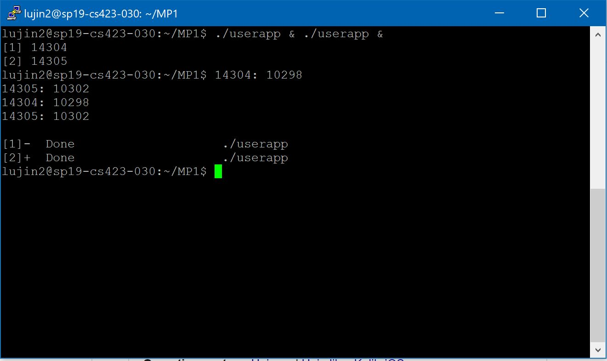

# mp1 

## Command to run the program
### Basic Functions
1) Compile the modules and user_app\
```make modules```\
```make app```

2) Insert compiled module into the kernel\
```sudo insmod mp1.ko```

3) Display the messages from the kernel ring buffer\
```dmesg```

4) Remove the module\
```sudo rmmod mp1```


### Read and Write Function
1) Write to /proc\
```echo "xxxx" > /proc/mp1/status```

2) Read from /proc\
```cat /proc/mp1/status```

3) Run the user program\
```./userapp &```

### Sample Output
1) Output of running two concurrent instances


2) Screenshot of ```cat /proc/mp1/status``` during the running process above

